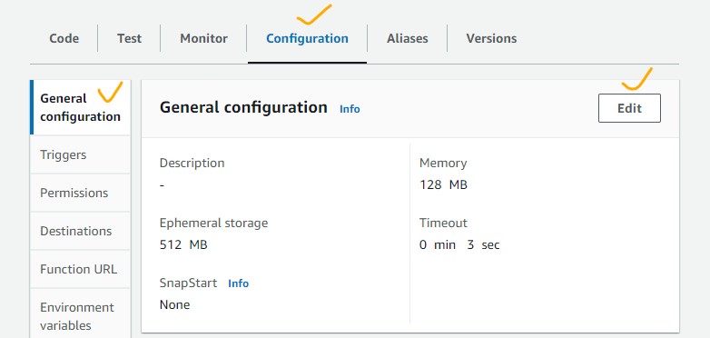
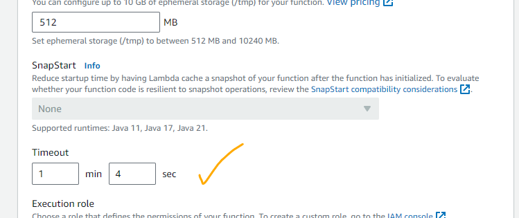
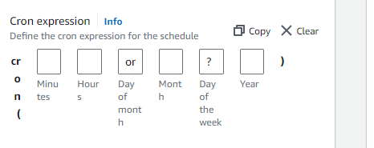

# Stopped EC2 instance using Lambda and CloudWatch

## Lambda excecution role
```
{
    "Version": "2012-10-17",
    "Statement": [
      {
        "Effect": "Allow",
        "Action": [
            
          "logs:CreateLogGroup", 
          "logs:CreateLogStream",
          "logs:PutLogEvents"
        ],
        "Resource": "arn:aws:logs:*:*:*"
      },
      {
        "Effect": "Allow",
        "Action": [
          "ec2:DescribeInstances",
          "ec2:DescribeRegions",
          "ec2:StartInstances",
          "ec2:StopInstances"
        ],
        "Resource": "*"
      }
    ]
  }
```

## Execution role explained

  - **logs:CreateLogGroup** : create log groug in CloudWatch

  - **logs:CreateLogStream** : create log stream in CloudWatch

  - **logs:PutLogEvents**     : put Event into log group in CloudWatch

  - **"arn:aws:logs:*:*:*"** : policy statement applies to all Amazon 
  CloudWatch Logs resources across all regions and all AWS accounts

  - **ec2:DescribeInstances** :  granting the ability to list and get detailed information about EC2 instances within your AWS account, such as their instance IDs, types, states (running, stopped, etc.), and other configurations

  - **ec2:DescribeRegions"** : enables t to list AWS regions

  - **ec2:StartInstances** : allows to start one or more Amazon EC2 (Elastic Compute Cloud) instances that are currently in a stopped state

  - **ec2:StopInstances** : stop one or more Amazon EC2 (Elastic Compute Cloud) instances that are currently in a running state

  - **"*"** : all instances

## Execution Timeout

We need to increase the execution timeout to allow the Lambda function to iterate through all the Regions. The default value is 3 seconds. We change it to 1 minute and 4 seconds.



## CloudWatch

* Rule type: Schedule
* Occurrence:  Recurring schedule
* Time zone : UTC
* Schedule type  : Cron-based schedule

   - Minutes:0
   - Hours: 6
   - Day-of-month: 1-31
   - Month: 1-12
   - Day-of-week: 1-7
   - Year: 2024-2025